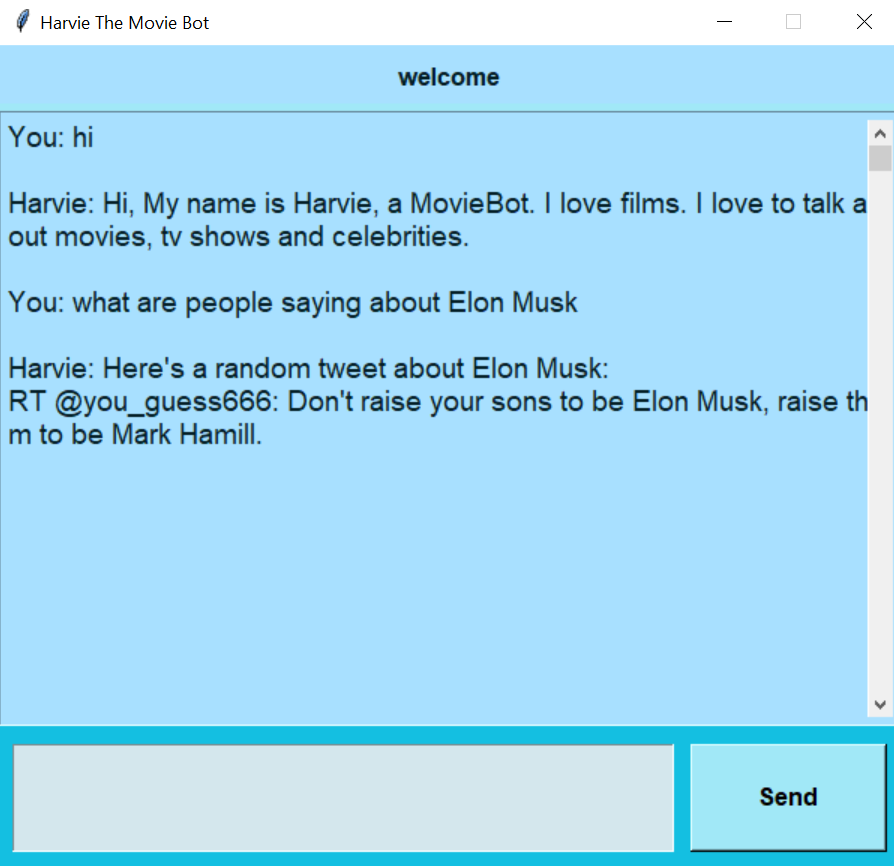
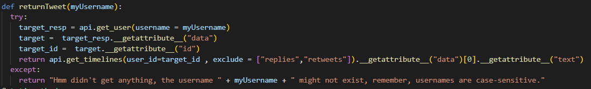

# Final Project
## Abhinav Thota - 38811428
## Group 26
## Github link: [**click here**](https://github.com/abeeto/finalProject_COSC310)

# Wikipedia API
### [**API LINK**](https://www.mediawiki.org/wiki/Python)
### code directly using api is on **mediaWiki.py** 
## Overview
One of the things I wanted our bot to do was give more details about any topic the user requested.
And so, I felt that whenever the user wanted to find out more about a topic, my bot should retrieve the summary page of specified topic and show that to the user.

## Function One: return table of contents
When the user types in that they want to know more about a certain topic, the bot must display how the page is organized as just printing out the entire page would seriously overwhelm the user.

The page name is sent as an argument as **search**, in the staticmethod, **returnTopics**. I also used a list comprehension to filter out sections the user would have little in interest in viewing.

## Function Two: retrieve topic 
The user is  instructed on how to access the right section of the page using a command they have to type into the prompt.
That command is parsed into the page the api has to search up on wikipedia and which topic it has to retrieve and return.
Would have liked this to be done in a easier way, but I didn't have the time.

The user has to type in *wiki PageName ContentNo in order to retrieve the content of the page and its topic. This is all parsed in the **Chatbot.py** file.

Retrieving the content is relatively simple:

# Twitter API
### [**API LINK**](https://github.com/sns-sdks/python-twitter)
### code directly using api is on **celebrityReturn.py** 

## Overview
Who doesn't want to know what random opinions or the latest news about celebrities or movies and tv shows. 

As the bot is centred around movies and celebrities, I wanted the option for Harvie to share to the user what other people are saying abouut a movie or an actor.

## Feature One: Retrieve random tweets surrounding people (movie, tv show, etc)
I created a class object that retrieves a random tweet that has any mention of a person or work of art.

To detect that the user has typed in a person's name, I reworked the NER recognition from the Stanza API.

The bot is able to retrieve the person that the user has typed in and then pass it as an argument into the static method,searchTweet,of my class object,tweeting.
The bot simply searches twitter for any mention of the passed argument and then randomly picks one in the list.

    
## Feature Two: Retrieve most recent tweet from someone's timeline
I also wanted Harvey to be able to retrieve people's most recent tweets from their username. For this to work the api needs to first get a timeline which is uniquely identified by a userid (which is a unique number assigned to each user). So, when our user types in the chat a username (e.g @elonmusk), Harvie will recognize that it is a username thanks to the inclusion of @ symbol. It then passes the username as an argument into the static method, *returnTweet*, of my class object, *tweeting*.

The bot will then pass the username to a built in function by the api to retrieve the userid. This user id is used to get the timeline of most recent tweets, retweets and replies created by that username. As we don't want retweets and replies, I have filtered out retweets and replies by using the exclude parameter in the function.

